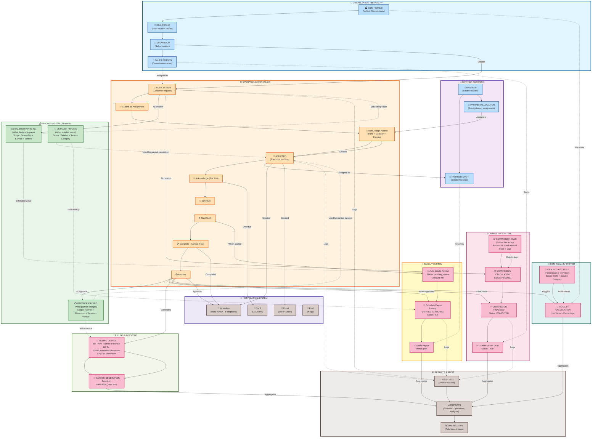

# Pulse VAS - Complete Business Process Flowchart

## Mermaid Diagram Code

Copy and paste this code into any Mermaid renderer (GitHub, Mermaid Live Editor, etc.)



---

## How to Use This Flowchart

### 1. **View in GitHub**
Simply paste this into any `.md` file in GitHub and it will render automatically.

### 2. **View in Mermaid Live Editor**
Go to https://mermaid.live and paste the code between the ` ```mermaid ` tags.

### 3. **Export as Image**
Use Mermaid Live Editor to export as:
- PNG (high resolution)
- SVG (vector, scalable)
- PDF (print-ready)

---

## Legend & Flow Explanation

### 📊 **Subgraph Colors**

| Color | Module | Description |
|-------|--------|-------------|
| 🔵 **Light Blue** | Organization | Entity hierarchy (OEM → Dealership → Showroom → Sales) |
| 🟣 **Purple** | Partner Network | External installation partners and staff |
| 🟠 **Orange** | Operations | Work order and job card execution workflow |
| 🟢 **Green** | Pricing System | 3-layer pricing (Dealership, Partner, Detailer) |
| 🔴 **Pink/Red** | Financials | Commissions, payouts, royalties, billing |
| 🟤 **Brown** | System | Notifications, audit logs, reports |

### 🔄 **Arrow Types**

| Arrow | Meaning |
|-------|---------|
| `-->` Solid | Direct process flow / creates / triggers |
| `-.->` Dotted | Data reference / influences / uses |

### 📋 **Key Process Flows**

#### 1️⃣ **Order Creation Flow**
```
Showroom → Work Order → Dealership Pricing → Commission (PENDING)
```

#### 2️⃣ **Job Execution Flow**
```
Work Order → Auto-Assign → Job Card → Acknowledge → Schedule → Start → Complete → Approve
```

#### 3️⃣ **Payout Flow**
```
Job Started → Auto-Create Payout (pending_review) 
→ Job Approved → Calculate Payout (due) 
→ Admin Settlement → Payout Paid
```

#### 4️⃣ **Commission Flow**
```
Work Order Created → Commission (PENDING, estimated value)
→ Job Approved → Commission (COMPUTED, final value)
→ Admin Settlement → Commission (PAID)
```

#### 5️⃣ **Pricing Interaction**
```
- DEALERSHIP PRICING → Sets work order billing value (what dealership pays)
- PARTNER PRICING → Used for partner invoice (what partner charges)
- DETAILER PRICING → Used for payout calculation (what installer earns)
```

#### 6️⃣ **Financial Cascade**
```
Job Approved → Triggers 4 calculations:
1. Partner Pricing (invoice)
2. Detailer Payout (installer payment)
3. Commission Finalization (sales person earning)
4. OEM Royalty (brand fee)
```

---

## System Insights

### 💡 **Multi-Layer Pricing Strategy**

The system uses **3 independent pricing layers** to support different business models:

1. **Dealership Pricing**: What the dealership is charged for the service
2. **Partner Pricing**: What the installation partner charges (may be direct to customer)
3. **Detailer Pricing**: What the individual installer earns (payout)

This allows for:
- 🎯 Flexible margin management
- 🤝 Partner direct billing options
- 💰 Fair installer compensation
- 📊 Clear profit tracking at each level

### 💡 **Commission Hierarchy**

The system resolves commission rules through **8 priority levels**:

```
1. Showroom + SalesPerson + ServiceCategory (most specific)
2. Showroom + SalesPerson
3. Showroom + ServiceCategory
4. Dealership + SalesPerson + ServiceCategory
5. Dealership + SalesPerson
6. Dealership + ServiceCategory
7. OEM + ServiceCategory
8. OEM + SalesPerson (most general)
```

This ensures sales persons get the **most specific rate** that applies to them.

### 💡 **Partner Auto-Allocation**

When a work order is submitted, the system automatically assigns a partner using:

```
Priority 1: Showroom-level + Brand match + Service category + Active + Priority number
Priority 2: Dealership-level + Brand match + Service category + Active + Priority number
Priority 3: Basic allocation (no brand/category match)
```

This ensures the **most qualified partner** gets the job.

### 💡 **Financial Settlement Visibility**

Payout settlement displays based on **payout status**, not job card status:

- ✅ Shows: `pending_review`, `due`
- ❌ Hidden: `paid`

This means approved jobs remain visible for settlement even when job cards move to:
- PENDING_SALES_INVOICE
- INVOICE_RAISED
- WARRANTY_REGISTRATION
- PAYMENT_PENDING
- CLOSED

---

## Quick Reference: Who Does What?

| Role | Primary Actions | Financial Impact |
|------|----------------|------------------|
| **OEM Admin** | Manage dealerships, vehicles, OEM pricing | Sets dealership pricing rules |
| **Dealership Admin** | Manage showrooms, override pricing | Controls dealership-level pricing |
| **Showroom Manager** | Create work orders, approve jobs | Triggers commission calculation |
| **Sales Person** | Assigned to orders | Earns commission |
| **Partner Admin** | Manage jobs, staff | Receives payouts |
| **Partner Staff** | Execute installations | Earns individual payout |
| **Super Admin** | System configuration | All financial rules |

---

**Generated**: October 24, 2025  
**System**: Pulse VAS - PPF Management Platform  
**Version**: 1.0
